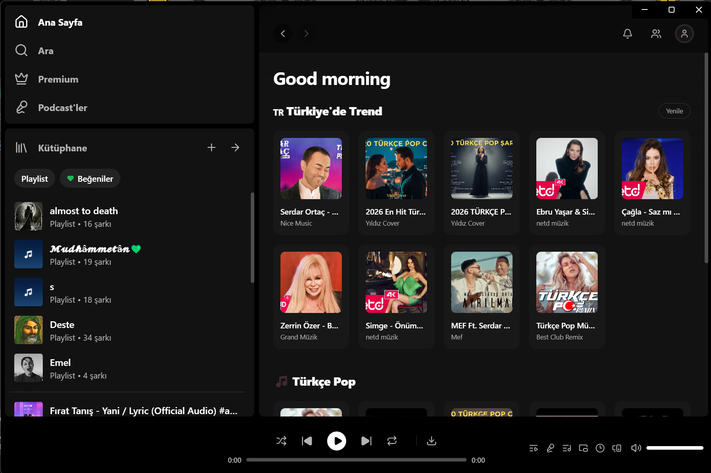
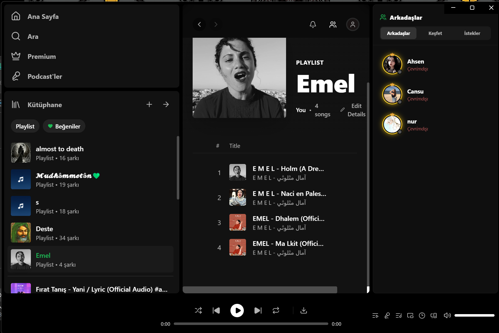

# 🚀 Tuzluca Music & Uygulama Sürümleri (Premium Edition)

**Sınırları Kaldıran, Özgür ve Güçlü Masaüstü Müzik Deneyimi**

> *Spotify'ın kusursuz hissiyatını, YouTube'un sınırsız kütüphanesiyle harmanlayan; sosyal ağ, eş zamanlı şarkı sözleri ve Jam (Birlikte Dinle) özellikleriyle donatılmış yeni nesil müzik platformu.*

[📥 İndir (Sürümler)](#-kurulum) · [✨ Benzersiz Özellikler](#-benzersiz-özellikler) · [🚀 Geliştirici Rehberi](#-geliştirici-rehberi) · [👑 Premium](#-premium-ayrıcalıkları)

---

## 📸 Arayüzden Kareler

  

  
  

---

## ✨ Benzersiz Özellikler

### 🎧 Sınırsız Ses Akışı (Streaming)
- **Güçlü Motor:** Arkasında çalışan `yt-dlp` mimarisi sayesinde YouTube üzerindeki milyarlarca şarkıya anında, yüksek kalitede, reklamsız erişim.
- **Akıllı Arama:** Sadece birkaç harf yazarak anında şarkı, sanatçı veya albüm bulabilme yeteneği.
- **Kusursuz Oynatıcı:** Otomatik sıradaki şarkıya geçme, Shuffle (Karıştır), Repeat (Tekrarla) ve şarkı içinde dilediğin saniyeye atlama (Seek).
- **Çevrimdışı Mod:** Sevdiğin müzikleri `.mp3` formatında bilgisayarına indirip internetsiz dinleyebilme ayrıcalığı.

### 👥 Sosyal Müzik Ağı (Arkadaş Sistemi)
- **Canlı Aktivite:** Ekranın sağındaki panelden arkadaşlarınızın anlık olarak hangi şarkıyı dinlediğini gerçek zamanlı takip edin.
- **Tek Tıkla Dinle:** Arkadaşınızın dinlediği şarkının üstüne tıklayarak ona anında eşlik edin.
- **Profil ve Kütüphane:** İstediğiniz kullanıcının profiline girip oluşturduğu "Halka Açık" playlist'leri görebilir ve çalabilirsiniz.
- **Gelişmiş Durum (Presence):** Arka plandaki zeki nabız (heartbeat) sistemi sayesinde arkadaşlarınızın çevrimiçi/çevrimdışı durumu anında güncellenir.

### 🎭 Jam Oturumu (Birlikte Dinle)
- Tıpkı Discord veya Spotify Jam gibi, saniyeler içinde **Rastgele Bir Oda (Oturum) Kodu** oluşturun.
- Kodunuzu paylaştığınız arkadaşlarınız odanıza katıldığında, şarkı **herkesin bilgisayarında milisaniyesine kadar aynı anda** çalar.
- Odayı kuran kişi (Host) müziği ileri sardığında veya değiştirdiğinde, tüm odadaki müzik senkronize olur.

### 🎤 Akıllı Şarkı Sözleri (Lyrics)
- **Senkronize Sözler:** Şarkı çalarken sözler satır satır akar ve o an söylenen cümle **parlayarak (highlight)** öne çıkarılır. (Lrclib altyapısı)
- Tam Ekran Moduna geçerek bilgisayarınızı devasa ve estetik bir Karaoke ekranına dönüştürebilirsiniz.

### 🎮 Discord Rich Presence
- Arka planda çalışırken otomatik olarak Discord profilinize bağlanır.
- Discord'da arkadaşlarınız **"Müzik Dinliyor: [Şarkı Adı] - [Sanatçı]"** durumunuzu, şarkının albüm kapağını ve kaçıncı saniyede olduğunuzu görür.

---

## 👑 Premium Ayrıcalıkları

Tuzluca Music, **"VIP"** kullanıcıları için özel kozmetik ve yönetimsel ayrıcalıklar sunar:
- **Dönen Altın Çerçeve:** Premium profillerin etrafında sürekli dönen, nefes kesici bir altın/gradyan halka bulunur.
- **Rozet Sistemi:** Arkadaş listelerinde adınızın yanında parlayan özel bir Taç (👑) rozeti yer alır.
- **Hediye Kodları (Gift Codes):** Sistem üzerinden üretilen özel `TUZLUCA-XXXX-XXXX` kodlarıyla arkadaşlarınızı anında Premium yapabilirsiniz.

---

## 🎨 Arayüz (UI) ve Performans Teknolojisi

- **Dinamik Renk Paleti:** Çalan şarkının albüm kapağındaki ana renkler süzülerek uygulamanın arka planına çok yumuşak bir ışık hüzmesi (Aura) olarak yansıtılır.
- **SwiftShader GPU:** Donanım ivmelendirmesi olmayan bilgisayarlarda bile animasyonların 60 FPS kaymak gibi akması için entegre Google SwiftShader teknolojisi.
- **Apple UI İzleri:** Tüm menüler, buton geçişleri, pencereler (Glassmorphism) ve yaylı (Spring) animasyonlar, native bir işletim sistemi hissiyatı yaratacak şekilde kodlanmıştır.

---

## 🚀 Kurulum (Kullanıcılar İçin)

Eğer sadece uygulamayı kurup müzik dinlemek istiyorsanız, kaynak kodlarla uğraşmanıza gerek yoktur:

1. **[Tuzluca App Sürümleri (Releases)](https://github.com/alicantuzluca/Tuzluca-App)** sayfasına gidin.
2. En güncel `Tuzluca-Setup.exe` dosyasını indirin.
3. Çift tıklayıp kurun ve masaüstünüzdeki kısayoldan sınırsız müziğin tadını çıkarın.

---

## 🗂️ Veritabanı ve Supabase Mimarisi

Supabase üzerinde çalışan PostgreSQL veritabanımız, devasa bir veri yönetimini eşzamanlı (Realtime) olarak yönetir. Projedeki bazı temel tablolar:

- **`profiles`**: Kullanıcıların statüsü (online/offline), şu an dinlediği şarkı (JSON), biyografisi ve Premium olup olmadığı.
- **`friendships`**: İki kullanıcı arasındaki arkadaşlık istekleri (bekliyor/kabul edildi).
- **`playlists` & `playlist_songs`**: Kullanıcıların oluşturduğu listeler ve içlerindeki şarkıların YouTube URL/Thumbnail verileri.
- **`gift_codes`**: Premium üyelik sağlayan tek kullanımlık sistem kodları.

*(Geliştiriciler, `src/lib/supabase.ts` içindeki URL ve Key değerlerini kendi Supabase projelerine bağlamalıdır.)*

---

Bu proje, kod sanatı ve üst düzey kullanıcı deneyimi felsefesiyle **Alican Tuzluca** tarafından tasarlanmış ve geliştirilmiştir.  

⚠️ **YASAL UYARI:** Tuzluca Music, kapalı ve özel (private) bir projedir. Uygulamanın kodlarının herhangi bir şekilde kopyalanması, klonlanması, satılması veya izinsiz olarak başka platformlarda dağıtılıp ticari gelir elde edilmesi **kesinlikle yasaktır.** Uygulama sadece kurulum (.exe) dosyası olarak son kullanıcıların kişisel deneyimi için yayınlanmaktadır.

